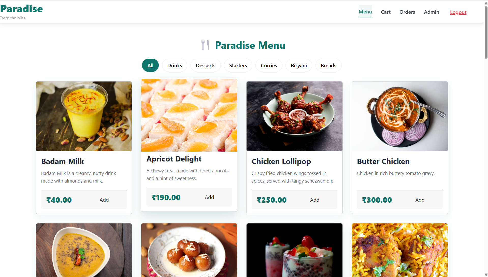
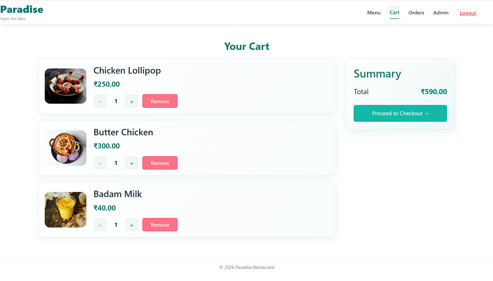
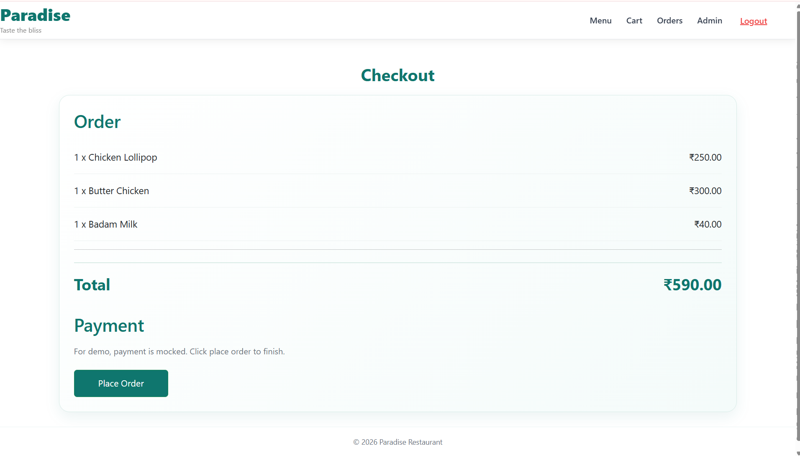
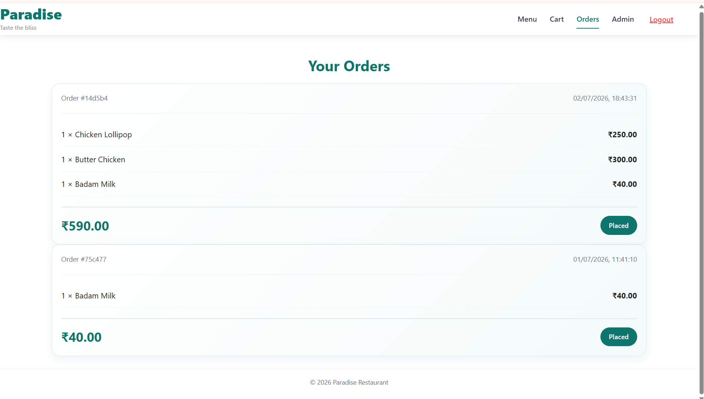

# 🍽️ Paradise Restaurant Ordering & Management System

A full-stack restaurant ordering and management system built with the MERN stack.

Customers can browse the restaurant menu, add food to the cart, place orders, and view their order history. Administrators can securely manage menu items through a dedicated dashboard.

---

# Live Demo

**Frontend**

https://restaurant-ordering-and-management.vercel.app

**Backend API**

https://paradise-restaurant.onrender.com/api

---

# Preview

### Home



---

### Cart



---

### Checkout



---

### Orders



---

### Admin Dashboard


---

# Features

## Customer

- User Registration
- User Login
- JWT Authentication
- Browse Restaurant Menu
- Category-based Menu Filtering
- Responsive Menu Layout
- Add Items to Cart
- Update Cart Quantity
- Checkout Process
- View Order History
- Responsive User Interface

---

## Administrator

- Secure Admin Login
- Add Menu Items
- Edit Menu Items
- Delete Menu Items
- Manage Restaurant Menu

---

# Tech Stack

## Frontend

- React 19
- React Router DOM
- Axios
- Bootstrap
- React Bootstrap
- CSS3

## Backend

- Node.js
- Express.js
- JWT Authentication
- REST APIs

## Database

- MongoDB
- Mongoose

---

# Folder Structure

```text
Restaurant-Ordering-and-Management-System
│
├── backend
│   ├── config
│   ├── middleware
│   ├── models
│   ├── routes
│   ├── server.js
│   └── package.json
│
├── frontend
│   ├── public
│   ├── src
│   │   ├── api
│   │   ├── components
│   │   ├── styles
│   │   └── App.js
│   └── package.json
│
└── screenshots
```

---

# Installation

## Clone Repository

```bash
git clone https://github.com/d33pak1065/Restaurant-Ordering-and-Management-System.git
```

## Backend Setup

```bash
cd backend

npm install

npm run dev
```

Backend runs locally on

```text
http://localhost:5000
```

---

## Frontend Setup

```bash
cd frontend

npm install

npm start
```

Frontend runs locally on

```text
http://localhost:3000
```

---

# Environment Variables

## Backend (.env)

```env
PORT=5000
MONGODB_URI=your_mongodb_connection_string
JWT_SECRET=your_secret_key
CLIENT_URL=http://localhost:3000
```

## Frontend (.env)

```env
REACT_APP_API_URL=http://localhost:5000/api
```

---

# API Endpoints

## Authentication

```http
POST   /api/auth/register
POST   /api/auth/login
```

## Menu

```http
GET    /api/menu
POST   /api/menu
PUT    /api/menu/:id
DELETE /api/menu/:id
```

## Orders

```http
POST   /api/orders
GET    /api/orders/my
```

---

# Deployment

## Frontend

Vercel

https://restaurant-ordering-and-management.vercel.app

## Backend

Render

https://paradise-restaurant.onrender.com/api

---

# Future Improvements

- Online Payment Integration
- Food Search
- Order Tracking
- Customer Profile
- Email Notifications
- Dashboard Analytics
- Image Upload

---

# Author

**Sri Deepak Bolisetti**

Associate Software Developer

GitHub

https://github.com/d33pak1065

LinkedIn

https://www.linkedin.com/in/sri-deepak-bolisetti-096006344
