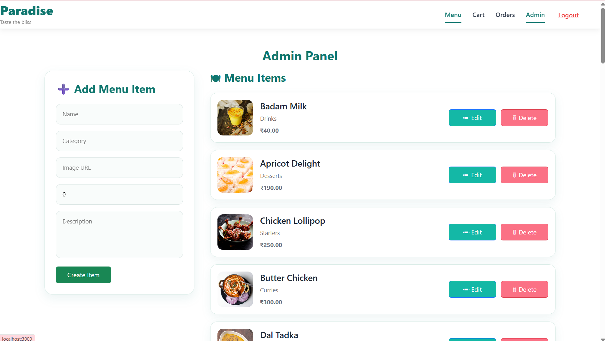

# 🍽️ Paradise Restaurant Ordering & Management System

A full-stack restaurant ordering and management system built with the MERN stack.

Customers can browse the menu, add food to the cart, place orders, and view order history. Administrators can manage menu items through a dedicated dashboard.

---

## Preview

### Home


---


### Cart


---

### Checkout


---

### Orders


---

### Admin Dashboard



---

# Features

## Customer

- User Registration & Login
- JWT Authentication
- Browse Restaurant Menu
- Category Filtering
- Responsive Menu Cards
- Add to Cart
- Update Cart Quantity
- Checkout
- Order History
- Responsive Design

---

## Admin

- Secure Admin Login
- Add Menu Items
- Edit Menu Items
- Delete Menu Items
- Manage Restaurant Menu

---

# Tech Stack

### Frontend

- React 19
- React Router DOM
- Axios
- Bootstrap
- React Bootstrap
- CSS3

### Backend

- Node.js
- Express.js
- JWT Authentication
- REST API

### Database

- MongoDB
- Mongoose

---

# Folder Structure

```
Restaurant-Ordering-System
│
├── backend
│   ├── config
│   ├── middleware
│   ├── models
│   ├── routes
│   ├── controllers
│   └── server.js
│
└── frontend
    ├── public
    ├── src
    │   ├── api
    │   ├── components
    │   ├── pages
    │   ├── styles
    │   └── App.js
```

---

# Installation

## Clone Repository

```bash
git clone https://github.com/YOUR_USERNAME/restaurant-ordering-system.git
```

---

## Backend

```bash
cd backend

npm install

npm run dev
```

Backend runs on

```
http://localhost:5000
```

---

## Frontend

```bash
cd frontend

npm install

npm start
```

Frontend runs on

```
http://localhost:3000
```

---

# Environment Variables

Backend (.env)

```env
PORT=5000

MONGO_URI=your_mongodb_connection_string

JWT_SECRET=your_secret_key
```

Frontend

```env
REACT_APP_API_URL=http://localhost:5000/api
```

---

# API Endpoints

## Authentication

```
POST   /api/auth/register

POST   /api/auth/login
```

## Menu

```
GET    /api/menu

POST   /api/menu

PUT    /api/menu/:id

DELETE /api/menu/:id
```

## Orders

```
POST   /api/orders

GET    /api/orders/my
```


---

# Future Improvements

- Online Payment Integration
- Food Search
- Image Upload
- Order Tracking
- Email Notifications
- Dashboard Analytics

---

# Author

**Sri Deepak Bolisetti**

Associate Software Developer

GitHub

https://github.com/d33pak1065

LinkedIn

https://www.linkedin.com/in/sri-deepak-bolisetti-096006344
https://linkedin.com/in/sri-deepak-bolisetti-096006344
